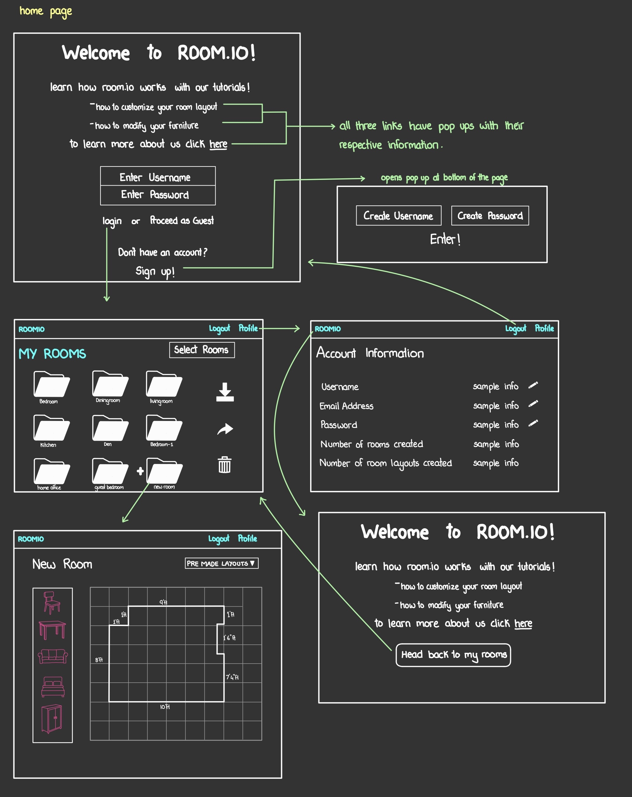

TEAM NAME:
Team Phi

Web Application Name:
Room.io

Team Members:
Aryun Gupta - AryunGupta
Mac Barlow - triplem123
Afsaana Bhatt - afsaanabhatt

Idea:
A platform for users that are in the process of either moving or renovating their homes. The platform will allow users to decide on how they would like to arrange things in their room such as furniture, lamps, plants, etc. The users will create an account in order to save all of their data for later use and to give them the ability to use other features that will be detailed later. Once their account is created, a user can create their room with specific dimensions and other features. Once their room's size and shape has been set up, they can add any pieces of furniture and other things that occupy their room from a given list of shapes and rearrange everything until they find a desired layout. After finalizing a layout, users can save the layout for later, save an image of their desired setup, or share it for other users to use as an example.

Components:
The application will let users create a 2D dimension of the room they want to focus on (with attaches pantries, closets, etc). Users can also add outlet placements in the room they are designing, so it can help them in deciding where to place their gadgets (PCs, TVs, lamps, etc.). The app will give users a warning when they place a piece of furniture that covers an outlet. They can select a piece of furniture in any shape (L shaped sofa, oval coffee table, etc.), input the size of it and drag and drop it on the 2D room scale. The shapes can be edited to be more accurate to what the user has for furniture, such as making a rectangular table sample shape longer or more narrow. If users already have furniture, it can help them figure out what can fit where and how to arrange it to maximize space to their liking. If users don’t have furniture, this platform can help them decide what furniture they would like to buy and in what size. If there are other people that would like to input their ideas too, the user can invite them to edit their design. They can create multiple combinations and save them to their folder and decide what they like the most. They can also create multiple rooms for office space, living room, etc. If a user has finalized a room layout and actually created it in real life, they will have the ability to upload images of the setup and share it online along with the virtual room design for others to see.

Wireframe:

User Interface:
The image below is the web application's home page where users can sign into their account, sign up to create and account, continue as guest (in guest mode users will not be able to save the rooms they create), watch tutorials to learn how to use the application, and learn more about the creators of the and the app itself.

If a user doesn’t have an account, they can click on sign up, which will open a pop up box that will ask the user to create a username and password, and then sign in. The image below shows the pop up box-

After signing up, when the user clicks login (or if the user already has an account and clicks on login), it will direct you to the “my rooms” page which will contain all the rooms that the user has created. They can select rooms and choose to delete, share, or download them. They can also create a new room my clicking “Create New Room”. The image below shows the page the user gets directed to after logging in. If the user continues as guest, the page will be the same except it will not contain all the extra rooms shown below that have been created by a signed in user.

If the user selects on profile while logged in, it will direct the user to a page that will contain the user’s login information (username, password, email address) and their room information. The user can edit their login information by clicking on the pencil icon. 

If the user selects the top left button named roomio, it will direct the user to the initial home page that contains the tutorials and “about us” information. If the user is logged in, it will not have the sign up/sign in options, but it will have a button named “head back to MyRooms”  which will lets the users go back to the my rooms page. The image below shows the page the logged in user is directed to when they click on “roomio”- 

If the user selects on either of the two buttons for tutorials or “about us” it will lead to a pop up on the same page, if it is a tutorial, it will show a pop up of multiple videos that focus on showing how to use different parts of the application. If the user selects “learn about Room.io” it will lead to a pop up that will have a small write up about the application and its creators. Since the tutorial will be videos of us using the application, we will add the pop up after we have completed creating the entire app. The same will go for the “learn about Room.io” option. Once we have created the whole app, and are certain about the whole working system, we will create this pop up.

In the “My Rooms” page, if the user selects “Create New Room” it will lead the user to a page that will contain a grid with a square room dimension, at reach edge they will be able to extend or shrink the dimensions of the room. At any point along the sides of the room, the user can double click to create a new point on the room dimension and adjust the shape of the room according to how their room looks like (for example a pillar at the edge of the room that protrudes inward).  The section where the user will create the room layout will be in a grid form to help users to make sure its symmetric. There will be an option of previously created room layouts the the user made from which they can choose. There will be a column of different types of furniture that the user can select to place in the room. Once the user selects a piece of furniture, they will have an option to modify the shape and size of the furniture before adding it to the room. Once they add the furniture to the room, they can always still modify it. We will give a few options of common furniture types for each piece (for example- for beds, we will give an option of twin, twin XL, full, queen, king options, for couches, an L shaped couch, a love seat, etc). 

Division Of Labor:
Team members met in person and worked on creating the html pages with css files by pair programming, we discussed it together and one person wrote it down. All three team members worked on the html and css for the home page, login page, logged out page, and Aryun uploaded the final files for those pages, All three team members worked on the html and css for the My Rooms page, profile page, create new room page, and Mac uploaded the final files for those pages. All three team members worked on creating the wireframe and milestone 1 write up, and Afsaana uploaded the final document on GitHub. Afsaana was responsible for designing the entire UI for the web application.