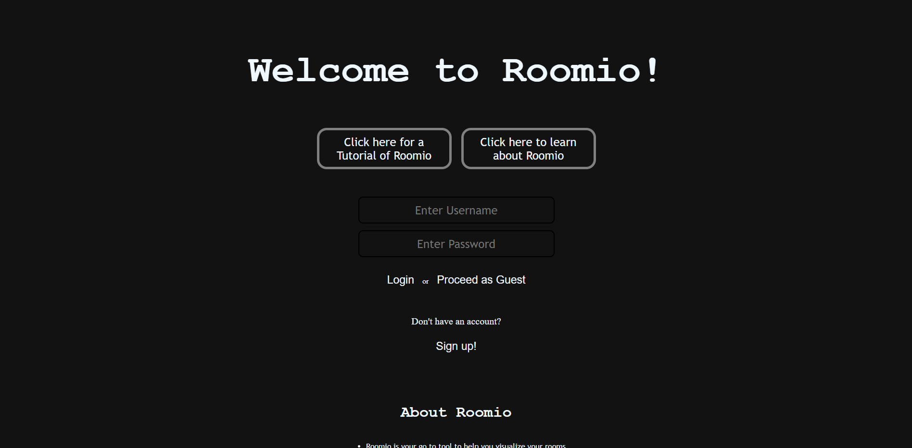
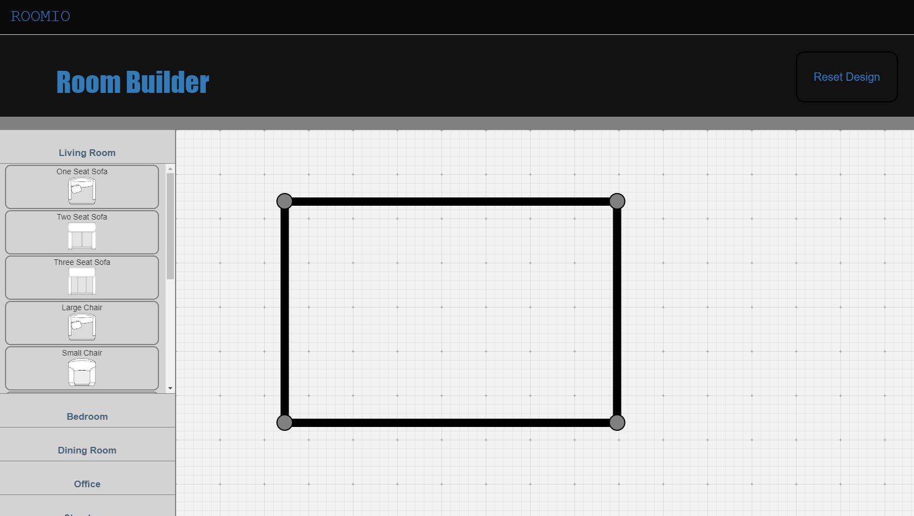
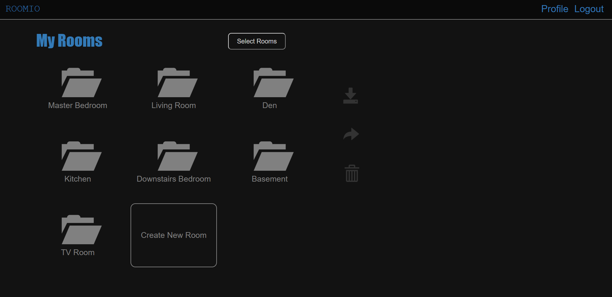
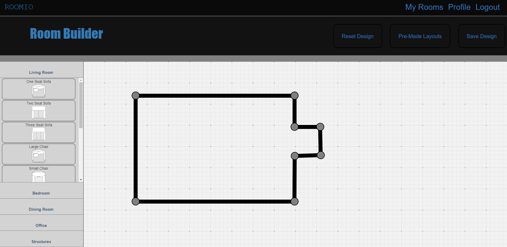

Database Schema:

User_Data document: {
    userhash: String // Hash assigned to a given user
    Email: String // Stores the user's email address
    Password: String // Stores the user's password
    Rooms_Created: Number // Stores the number of rooms that the user has
    rooms: Array[] { room: { // Array of room objects that store information about each room setup
        roomName: String // Stores the name of the room
        corners: String // Stores the outline of the room
        furniture: String // Stores the furniture in the room
    } }
}

Home page for non logged-in users:

Room builder for non logged-in users:

My rooms page for logged-in users:

Room builder for logged-in users:

URL: https://roomio-room-builder.herokuapp.com/

Account info for sample account:
- Email: test@fakeaddress.com
- Password: pass

Workload breakdown:
Mac: Added routing, polishing server.js, connection between the app and database, user schema
Aryun: Set up mongodb, connecting to database, testing database, user schema and cleanup
Afsaana: login authentication and related bug fixing

Notes:
- We had issues with hiding the DB URI, and we're still trying to get that to work (will likely be coming into office hours)
- We're finalizing user authentication but it's not fully functional yet, so we're using an alternative solution for now to allow for using the site with the sample account
- There's some other minor features that need to be added and some that need polishing, but all major functions should work as expected 